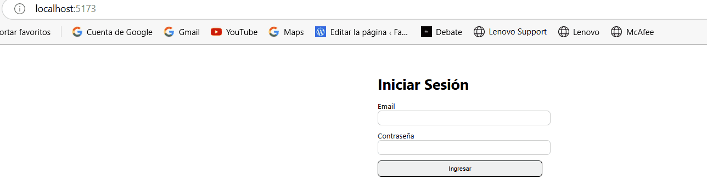
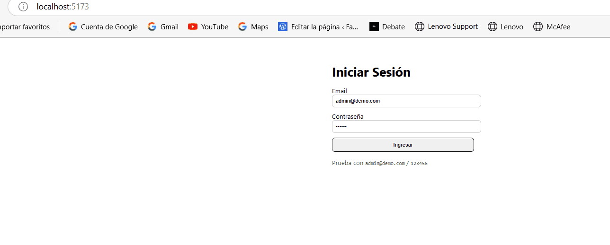

# Prototipo Funcional – Versión 0.1
**Curso:** Elaboración de Proyecto de Innovación y/o Mejora  
**Clase 4:** De la Arquitectura al Código

Este repositorio contiene un **MVP (flujo mínimo)** de una app web con:
- **Frontend:** React + Vite
- **Backend:** Node.js + Express
- **Base de Datos:** SQLite con Sequelize ORM
- **Autenticación básica:** login contra usuario sembrado

## Flujo mínimo (qué ya funciona)
1. Pantalla de **Login** (frontend).
2. Petición **POST /api/auth/login** al backend.
3. Validación de credenciales contra **SQLite**.
4. Respuesta del backend con **token JWT** simulado y datos del usuario.
5. Redirección a un **Dashboard** vacío.

> Usuario de prueba: `admin@demo.com`  
> Contraseña: `123456`

---

## Requisitos previos
- Node.js **>= 18**
- npm **>= 9**

> Si estás en Windows, usa **PowerShell** o **CMD**. En Mac/Linux, usa **Terminal**.

---

## Instrucciones de ejecución (2 terminales)
### 1) Backend
```bash
cd server
npm install
npm run seed   # crea/siembra el usuario admin
npm run dev    # inicia el API en http://localhost:4000
```

### 2) Frontend
```bash
cd client
npm install
npm run dev    # abre el frontend en http://localhost:5173
```

> Asegúrate que el backend esté corriendo en el puerto **4000**. El frontend usa `VITE_API_URL=http://localhost:4000` por defecto.

---

## Estructura de carpetas
```
.
├── client/                 # React + Vite
├── server/                 # Node + Express + Sequelize (SQLite)
├── docs/
│   ├── arquitectura.md     # Diagrama (Mermaid) y explicación
│   └── checklist.md        # Checklist de lo implementado
└── README.md
```

---

## Endpoints principales
- `GET /api/health` → estado del servidor y DB
- `POST /api/auth/login` → login (email, password)

---

## Demo (v0.1)


---

## Demo (v0.2) – Agregar producto


---

## Prueba entre equipos (sugerencias)
1. Ejecuta tu app y comparte la URL/README con otro equipo.
2. El otro equipo debe poder:
   - Iniciar el backend y frontend sin errores.
   - Realizar login con el usuario de prueba.
   - Ver el dashboard vacío.
3. Anotar **errores/enhancements** y proponer mejoras mínimas (p. ej., manejo de estados de carga, feedback de error en login).

---

## Entregables para la próxima clase
- ✅ Repositorio con código fuente (sube esto a GitHub).
- ✅ `README.md` con instrucciones (este archivo).
- 🟨 Captura o **GIF del flujo mínimo** (tómala tú con ScreenToGif/OBS/recorte).
- ✅ `docs/checklist.md` actualizado.

> **Cómo grabar un GIF (rápido):**
> - Windows: [ScreenToGif](https://www.screentogif.com/)  
> - Mac: QuickTime + [Gifski](https://gif.ski/)  
> - Linux: Peek

---

## Comandos útiles
```bash
# (opcional) Inicializa git en el repo local
git init
git add .
git commit -m "Clase 4 - Prototipo funcional v0.1"
# crea repo en GitHub y enlaza (reemplaza TU_USUARIO y TU_REPO)
git branch -M main
git remote add origin https://github.com/TU_USUARIO/TU_REPO.git
git push -u origin main
```

---

## Próximos pasos (ideas)
- Proteger rutas con el token en frontend (context/guard).
- Agregar roles y registrar usuarios.
- Dockerizar (compose para server+client).
- Crear módulos reales de tu caso (inventarios, tickets, etc.).
